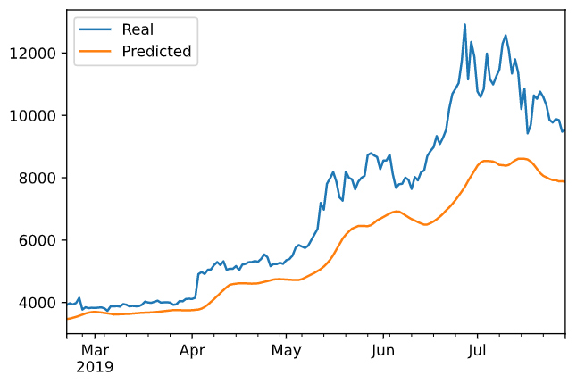
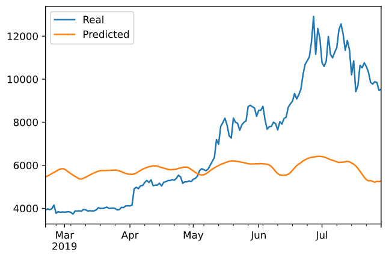

# LSTM Stock Predictor - Deep Learning
The following assignment is to show my comprehension and learning of Deep Learning methods taught by the Rice University FinTech Bootcamp and 2U.

---

## Table of contents
* [General Information](#general-information)
* [Summary](#summary)
* [Screenshots](#screenshots)
* [Technologies](#technologies)
* [Installation Guide](#installation-guide)
* [Code Examples](#code-examples)
* [Usage](#usage)
* [Sources](#sources)
* [Status](#status)
* [Contributors](#contributors)

---

## General Information

Due to the volatility of cryptocurrency speculation, investors will often try to incorporate sentiment from social media and news articles to help guide their trading strategies. One such indicator is the Crypto Fear and Greed Index (FNG), which attempts to use a variety of data sources to produce a daily FNG value for cryptocurrency. This project helps build and evaluate deep learning models using both the FNG values and simple closing prices to determine if the FNG indicator provides a better signal for cryptocurrencies than the normal closing price data.[1]

The project is broken into several parts to use deep learning recurrent neural networks modeling bitcoin closing prices. One model will use the FNG indicators to predict the closing price, while the second model will use a window of closing prices to predict the nth closing price.[1]

---

## Summary

* Which model has a lower loss?
    - The model using Closing Prices produces a lower loss of 0.0334 vs the other of 0.0868.

* Which model tracks the actual values better over time?
    - The model using Closing Prices tracks values better over time.

* Which window size works best for the model?
    - This answer depends on the desired outcome.  For better accuracy to follow the trend and price, use a smaller/shorter window size such as 1 or 2.  To follow the trend direction and not focus as much on price, use a larger/longer window size such as 9 or 10.

---

## Screenshots

* Closing Prices Model Prediction Comparison



* Fear and Greed Model Prediction Comparison



---

## Technologies

* Python 3.7.7
* See [requirements.txt](requirements.txt) for a list of libraries to create a machine learning environment.

---

## Installation Guide

1. Download the entire repository
2. Open Git Terminal
3. Navigate into the repository file path where you stored the files during the download.
4. The notebook files should be visible to run.
5. Make sure to create a separate virtual environment for the maching learning libraries (mlenv).
6. Use [requirements.txt](requirements.txt) in the repository to install the libraries using the following commands:

    - conda deactivate
    - conda create -n mlpenv python=3.7.7
    - conda activate mlenv
    - pip install -r requirements.txt
    - If the previous command has errors try:
        - conda install -r requirements.txt

*See the [Usage](#usage) section below for instructions to run the notebook.

---

## Code Examples

* LSTM Model
``` python
model = Sequential()

number_units = 30
dropout_fraction = 0.2

# Layer 1
model.add(LSTM(
    units = number_units,
    return_sequences = True,
    input_shape = (X_train.shape[1], 1))
)
model.add(Dropout(dropout_fraction))

# Layer 2
model.add(LSTM(units=number_units, return_sequences=True))
model.add(Dropout(dropout_fraction))

# Layer 3
model.add(LSTM(units=number_units))
model.add(Dropout(dropout_fraction))

# Output layer
model.add(Dense(1))
```

* Creates an array of rolling windows for X and y
``` python
def window_data(df, window, feature_col_number, target_col_number):
    X = []
    y = []
    for i in range(len(df) - window - 1):
        features = df.iloc[i:(i + window), feature_col_number]
        target = df.iloc[(i + window), target_col_number]
        X.append(features)
        y.append(target)
    return np.array(X), np.array(y).reshape(-1, 1)
```

---

## Usage

* To run the analysis process using the closing prices model:

    1. Navigate to lstm_stock_predictor_closing.ipynb using Git Terminal within the directory lstm_stock_predictor.

    2. Execute the command 'code .' in the terminal to open VS Code.

    3. VS Code opens.  Select the crypto_sentiment.ipynb file found in the left side navigation pane.

    4. Click the Run All Cells button, double arrows, found at the top of the main workspace to run all cells in the Jupyter Notebook file.

* To run the analysis process using the Fear and Greed (FNG) model:

    1. Select the crypto_sentiment.ipynb file found in the left side navigation pane of VS Code.

    2. Click the Run All Cells button, double arrows, found at the top of the main workspace to run all cells in the Jupyter Notebook file.

---

## Sources

- [1] https://rice.bootcampcontent.com/Rice-Coding-Bootcamp/rice-hou-fin-pt-09-2020-u-c/tree/master/hw/14-Deep-Learning/Instructions

---

## Status

Project is: _Complete_

---

## Contributors

* Jonathan Owens
* LinkedIn: www.linkedin.com/in/jonowens
